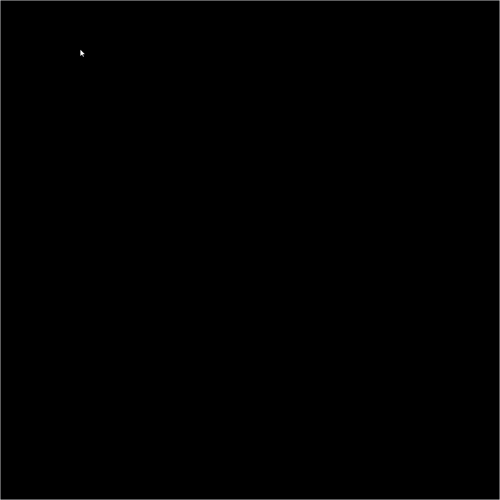

# Game of Life

### An interactive pygame implementation of quadtree spatial quantization

## Installation

Clone the repo and navigate into it.
```bash
git clone https://github.com/ethanavatar/QuadTree-py.git
cd QuadTree/
```

Install pygame if you don't have it already,
```bash
python -m pip install pygame
```

## Usage

Run the main module using:
```bash
python main.py
```

You can use:
 - `ESCAPE` to clear the current board
 - `R` to create a new random board
 - `LEFT MOUSE` to add or remove cells

By default, the window is 1200x1200 pixels, the game board is 200x200 cells, and it runs at 60fps. These constants are stored at the top of the [`locals.py`](src/quadtree/locals.py) file if you feel like changing them.



## TODO
 - Make more generic; framework agnostic